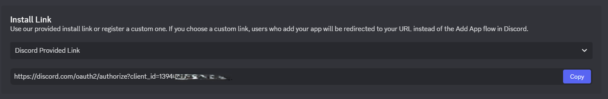

# PCA - Plex Content Alert
PCA - Plex Content Alert is a node.js application to serve discord notifications of new content added to a plex server. When new content is added a message is generated and sent to a discord bot for posting. 

PCA will handle both movies and tv show additions with specific message types for each. 

## Example of Notifications

Example of a Movie addition to plex with the default settings enabled.


Example of a TV show addition to plex with default settings enabled


## Pre-requestes 
1. Node installed - Available [here](https://nodejs.org/en/download)
2. Confirm Node and npm is installed by running ``` node -v ``` and ``` npm -v ``` 


## Setup

1. Clone this repo locally or download
2. Create or have a Discord bot available for your discord server. If you do not have a bot already available see Setting up a Discord Bot section
3. Using a terminal or command line run ```npm install ``` to install package dependencies 
4. Required updating of the ```config.json``` file
    1. ```token``` should be updated with your Bot token. This is available on [discord.dev applications](https://discord.com/developers/applications), selecting your application (bot) -> Bot -> Reset Token. You will need to reset token to be given a token.
    2. ```guild_id``` should be updated with your server id. This can be found by enabling Developer Mode on your discord app and right clicking your server -> ``` Copy Server ID ``` . To enable developer mode click settings for your user -> Advanced -> Enable Developer mode should be toggled on. 
    3. ```channel_id``` should be udpate with the channel you want the notifications posted to. To find the channel id you need developer mode enabled. Simply right click on the channel and click ```Copy Channel ID```
5. Optional updates of the ```config.json```
    1. ```show_scores``` toggles showing any scores (critic or audience). Supports ```false``` to disable or ```true``` to enable.
    2. ```show_audience_scores``` toggles showing the audience score on the notification. Supports ```false``` to disable or ```true``` to enable. ```show_scores``` must be enabled to see audience scores
    3. ```show_critic_scores``` toggles showing the critic scores on the notification. Supports ```false``` to disable or ```true``` to enable. ```show_scores``` must be enabled to see audience scores
    4. ```show_genres``` toggles showing the contents genre on the notifiation. Supports ```false``` to disable or ```true``` to enable.
    5. ```max_genres_to_show``` determines the numebr of genres to attempt to supply for a show. Supports numerical values ```1``` to ```10```. ```show_genres``` must be enabled for this flag to apply 
    6. ```critic_cources``` is a list of sources that the critic scores should attempt to be pulled from. Supports ```rotten tomatoes``` , ```imdb``` and/or ```tmdb```. Default config is to pull from all three. ```show_scores``` and ```show_critic_scores``` must be enabled for this flag to apply. 
    7. ```whitelist_enabled``` enabled IP whitelisting to prevent some malicious agents. ***This is not a gurantee but an attempt to ignore message from soruces that are not approved*** 
    8. ```whitelist_ip``` is a list of IP addresses approved to process messages from. These should be any Plex server IP address. If you are hosting this on your plex server your IP might be ```:ffff:{machines ip address}``` or ```{machine ip address}```. You should be able to see a message logged in the terminal/command prompt with the ip address if you are having difficult. ```whitelist_enabled``` must be set to enabled for this flag to be evaluated. 
    9. ```elapsed_time``` determines the posting time between the same content posting. For example if multiple episodes of a TV show is upload this value is checked for recent posting to avoid spamming the channle. This supports values of ```0``` to ```99999```. The value is in minutes so ```720``` is 12 hours.  
6. Updating your Plex Server Webhook settings to enable posting to this application
    1. Navigate to your Plex Server Settings -> WebHooks. This can typically be done from your browser at [https://app.plex.tv/desktop/#!/settings/webhooks](https://app.plex.tv/desktop/#!/settings/webhooks)
    2. Click ```Add webhook``` 
    3. the URL should be the URL of your machine that is hosting this application an example would be ```http://192.168.1.1:3000/plexwebhook``` The IP address can change but the port should be specified as ```3000``` and the path ```/plexwebhook``` or ```http://{your machines ip address}:3000/plexwebhook```
7. Launch the application but running ```node app.js``` in a terminal/command prompt in the root directory of this application. 


## Setting up a Discord Bot

1.  [Discord Developer](https://discord.dev)
2. Create a new application with your developer account by clicking  "New Application" [here](https://discord.com/developers/applications) 
3. Give your bot a name and accept the terms
4. Navgiate to the inInstallation settings section
5. Copy the Install Link into another browser window.  
6. Install the bot on your server
7. Confirm the bot has been added succesfully by right clicking your server -> Server Settings -> Integrations and confirming your bot is listed
8. The bot does not require special permissions


## Testing the Setup
If you desire you can test your setup by sending a POST to ```{your ip address}:3000/plexwebhook``` in an application such as Postman. 

There are provided examples of the payload json in the ```test``` directory. 

The Body should be of type ```form-data``` and contain one key ```payload``` with the value being the JSON from either test file. 

You may also delete ```plex_content.db``` if you are testing TV series to avoid the ```elapsed_time``` not posting between runs. You can set ```elapsed_time``` to 0 to avoid this issue. 


